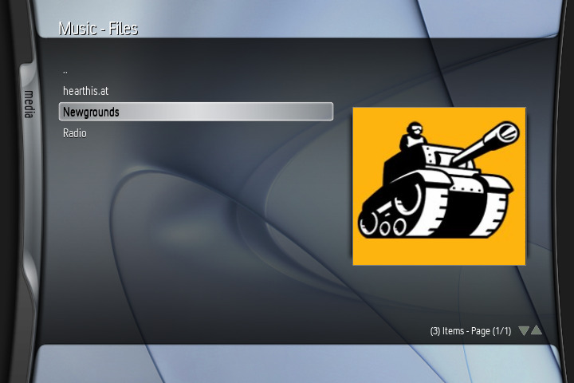
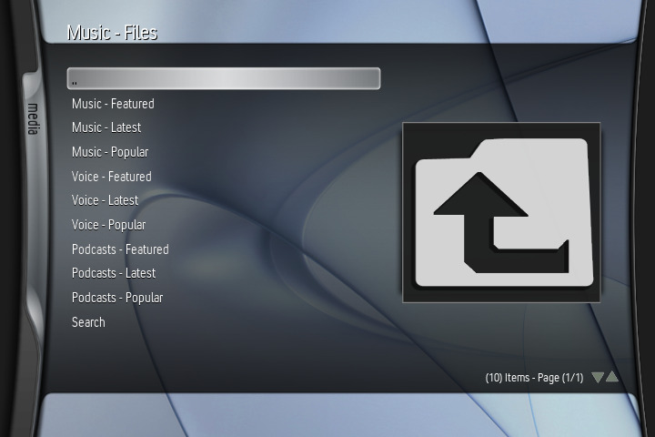
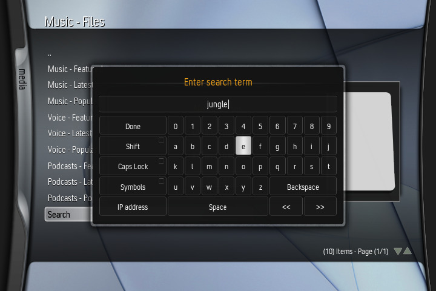
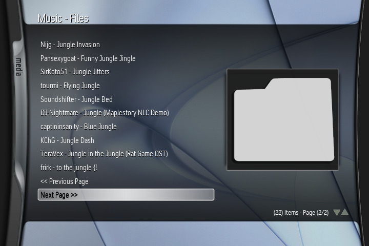

# Newgrounds Audio
Basic Newgrounds Audio Portal client for XBMC.

Requires the latest version of XBMC (3.6-DEV-r33046 or later) from Xbins (as it has crucial TLS/SSL updates that allow this script to work).

## How To Use:
- Download latest release file.
- Extract the .zip file.
- Copy the "Newgrounds" folder to Q:/plugins/music
- Run the add-on and enjoy!
- To download tracks, open up the context menu and select "Download Track".

## Issues:
- Thumbnails are currently broken as Newgrounds uses .webp, which XBMC doesn't support.
- If you get an error while saving a download, you either don't have an F:/ partition (if this is the case, open default.py in a text editor and change "F:/" to "E:/"), or the filename is breaking something FATX related. If that's not the case, please open an issue!
- Featured/Latest/Popular sections don't support pages. Unlike with searches, these sections don't present a page query value in the HTML to use, and I have no idea how to implement Next/Previous on pages that rely on autoscroll to present more information.
- You tell me.

## TODO:
- List "Music", "Voice", and "Podcasts" as their own categories containing Featured / Latest / Popular, instead of all at once.
- Implement better filename sanitization.
- Incorporate update script(?)
- Clean up code.
